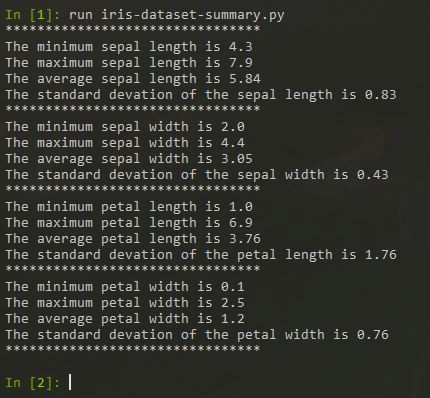

# Programming and Scripting Project 2019

# Iris Dataset

## Background

The Iris flower dataset was put forward by the British biologist and statistician Ronald Fisher in his 1936 paper 'The use of multiple measurements in taxonomic problems', this is an example of linear discrimminate analysis. The Iris dataset is an example of a multivarience dataset, multivarience datasets reduce the probably of type 1 errors in statistical analysis. Multivariance datasets analysis are almost always performed in software.

The Iris flower dataset comprises of 50 samples of three Iris flower species, Iris Sentosa, Versicolor and Virginica, giving a total of 150 data samples in the dataset.

The dataset comprises of five following attributes, the first four attributes are measurements of the flowers in cm and the fifth is the flower species the measurements were carried out on.

## Python Libraries Used 

The following python librarys are used to analyse the Iris Dataset. 
#### NumPy  
NumPy is a library that provides support for large multidimensional arrays and matrices. It also has a large collection of high level mathemicial functions to operate on such arrays. 
#### Matplotlib  
Matplotlib is a plotting library for the Python programming language and the numerical library NumPy, it provides graphical representations of data arrays.
#### Pandas  
Pandas is a software programming library written for data analysis and manipulation for the Python programming language. It offers data structures and operations for manipulating numerical tables and time series. It is free software released under the three-clause BSD license. Pandas is built on top of NumPy
#### Seaborn  

## Analysing the Data

_iris-dataset-summary.py_ was written to summarise the Iris Dataset, it uses NumPy to calculate the min, max, mean and standard devation from the Iris Dataset sample in the file _iris-dataset.csv_ . The program is run in iPython see output sample below.

## References

Iris flower data set: https://en.wikipedia.org/wiki/Iris_flower_data_set. 
Sir Ronald Fisher: https://en.wikipedia.org/wiki/Ronald_Fisher. 
Multivariate statistics: https://en.wikipedia.org/wiki/Multivariate_statistics. 
Multivariate analysis: https://www.statisticshowto.datasciencecentral.com/probability-and-statistics/multivariate-analysis./ 
Iris Data Set: https://archive.ics.uci.edu/ml/datasets/iris/ 
Iris Data Set CSV: https://datahub.io/machine-learning/iris#resource-iris. 
Machine Learning: https://machinelearningmastery.com/machine-learning-in-python-step-by-step/. 
NumPy: https://en.wikipedia.org/wiki/NumPy. .
Pandas: https://en.wikipedia.org/wiki/Pandas_(software).  .

