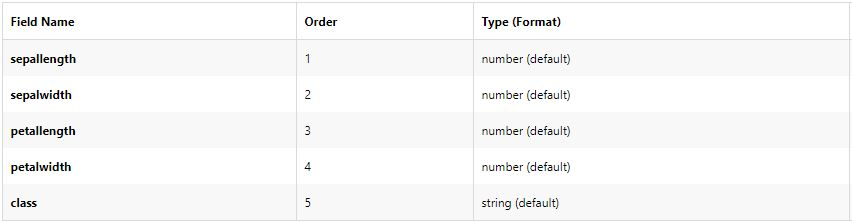

# Programming and Scripting Project 2019

# Iris Dataset

## Background

The Iris flower dataset was put forward by the British biologist and statistician Ronald Fisher in his 1936 paper 'The use of multiple measurements in taxonomic problems', this is an example of linear discrimminate analysis. The Iris dataset is an example of a multivarience dataset, multivarience datasets reduce the probably of type 1 errors in statistical analysis. Multivariance datasets analysis are almost always performed in software.

The Iris flower dataset comprises of 50 samples of three Iris flower species, the Iris Sentosa, Versicolor and Virginica, giving a total of 150 data samples in the dataset.

The dataset comprises of five following attributes, the first four attributes are measurements of the flowers in cm and the fifth is the flower species the measurements were carried out on.

## References

Iris flower data set: https://en.wikipedia.org/wiki/Iris_flower_data_set. 
Sir Ronald Fisher: https://en.wikipedia.org/wiki/Ronald_Fisher. 
Multivariate statistics: https://en.wikipedia.org/wiki/Multivariate_statistics. 
Multivariate analysis: https://www.statisticshowto.datasciencecentral.com/probability-and-statistics/multivariate-analysis./ 
Iris Data Set: https://archive.ics.uci.edu/ml/datasets/iris/ 
Iris Data Set CSV: https://datahub.io/machine-learning/iris#resource-iris. 
Machine Learning: https://machinelearningmastery.com/machine-learning-in-python-step-by-step/. 

