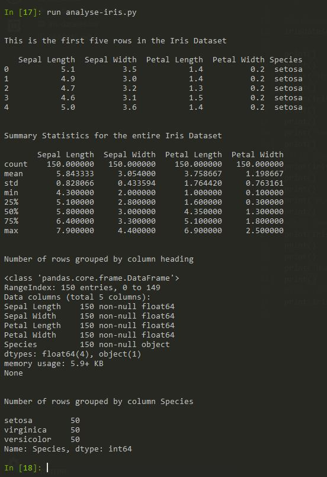

# Programming and Scripting Project 2019

# Iris Dataset

## Background

The Iris flower dataset was put forward by the British biologist and statistician Ronald Fisher in his 1936 paper 'The use of multiple measurements in taxonomic problems', this is an example of linear discrimminate analysis. The Iris dataset is an example of a multivarience dataset, multivarience datasets reduce the probably of type 1 errors in statistical analysis. Multivariance datasets analysis are almost always performed in software.

The Iris flower dataset comprises of 50 samples of three Iris flower species, Iris Sentosa, Versicolor and Virginica, giving a total of 150 data samples in the dataset.

The dataset comprises of five following attributes, the first four attributes are measurements of the flowers in cm and the fifth is the flower species the measurements were carried out on.

## Python Libraries Used 

The following python librarys are used to analyse the Iris Dataset. 
#### NumPy  
NumPy is a library that provides support for large multidimensional arrays and matrices. It also has a large collection of high level mathemicial functions to operate on such arrays. 
#### Matplotlib  
Matplotlib is a plotting library for the Python programming language and the numerical library NumPy, it provides graphical representations of data arrays.
#### Pandas  
Pandas is a software programming library written for data analysis and manipulation for the Python programming language. It offers data structures and operations for manipulating numerical tables and time series. It is free software released under the three-clause BSD license. Pandas is built on top of NumPy
#### Seaborn  

## Tools Used

The following tools were used to script, test and run the python programs.

#### Anaconda
This is the python programming software distribution that was running on my machine.

#### Visual Studio Code  
This program was used to write python programs for analysing the dataset

#### iPython
This is an interactive shell program used to run individual or multiple lines of python code. It was used for testing parts of a program that were been developed and showing outputs of the full program. It was also used to display graphs of programs that were just ran from data was stores in variables of that program.

## Analysing the Data

_iris-dataset-summary.py_ was written to summarise the Iris Dataset, it uses NumPy to calculate the min, max, mean and standard devation from the Iris Dataset sample in the file _iris-dataset.csv_ . The program was run in iPython see output sample below.

Click on the link [_iris-dataset-summary.py_](https://github.com/moranneil/pands-final-project-2019/blob/master/iris-dataset-summary.py) to view the code.

_analyse-iris.py_ is a program that uses Pandas to import the data from a CSV file _iris-dataset.csv_, it assigns headings to each of the five columns in the dataset and various outputs are obtained to give statistical information on the dataset. The example below runs the entire program from the iPython command line. Each of the pandas commands can also be run individually once the file is imported using pandas.

Click on the link [_analyse-iris.py_](https://github.com/moranneil/pands-final-project-2019/blob/master/analyse-iris.py) to view the code.

## Data Visualisation

### Histogram

The python program _analyse-iris.py_ variable values obtained in the previous section, can be used to generate plots. The following lines were entered in iPython.

The resulting Histogram is generate from the code above. This complete python program is saved as _analyse-iris-generate-histogram.py_ 

Click on the link [_analyse-iris-generate-histogram.py_](https://github.com/moranneil/pands-final-project-2019/blob/master/analyse-iris-generate-histogram.py) to view the code.

### Boxplot

The following lines were entered in iPython to generate a Boxplot of the Iris Dataset. The program analyse-iris.py was ran to ensure that the dataset variables were set. See iPython image below.

The Boxplot of the Iris Dataset is given below.

The python program _analyse-iris-generate-boxplot.py_ can also be ran to populate the variables and generate the same resulting Boxplot. Click on the link [_analyse-iris-generate-boxplot.py_](https://github.com/moranneil/pands-final-project-2019/blob/master/analyse-iris-generate-boxplot.py) to view the code.

### Scatterplots
The Iris Dataset can be plotted using Scatterplots. Here we plot two scatter plots for each of the three species of Iris flower for both sepal and petal width and length comparsions.

The iPython code for the Iris Sepal Scatterplot is given below. Like the other programs the same libraries are imported. The extra lines of code for the sepal Scatterplot are given below.

The Sepal Scatterplot for the Iris Dataset is given below.

Click on the link [_analyse-iris-generate-sepal-scatterplot.py_](https://github.com/moranneil/pands-final-project-2019/blob/master/analyse-iris-generate-sepal-scatterplot.py) to view the code.

The iPython code for the Iris Petal Scatterplot is given below. Like the other programs the same libraries are imported. The extra lines of code for the petal Scatterplot are given below.

The Petal Scatterplot for the Iris Dataset is given below.

Click on the link [_analyse-iris-generate-petal-scatterplot.py_](https://github.com/moranneil/pands-final-project-2019/blob/master/analyse-iris-generate-petal-scatterplot.py) to view the code.

## References

Iris flower data set: https://en.wikipedia.org/wiki/Iris_flower_data_set. 
Sir Ronald Fisher: https://en.wikipedia.org/wiki/Ronald_Fisher. 
Multivariate statistics: https://en.wikipedia.org/wiki/Multivariate_statistics. 
Multivariate analysis: https://www.statisticshowto.datasciencecentral.com/probability-and-statistics/multivariate-analysis./ 
Iris Data Set: https://archive.ics.uci.edu/ml/datasets/iris/ 
Iris Data Set CSV: https://datahub.io/machine-learning/iris#resource-iris. 
Machine Learning: https://machinelearningmastery.com/machine-learning-in-python-step-by-step/. 
NumPy: https://en.wikipedia.org/wiki/NumPy. 
Pandas: https://en.wikipedia.org/wiki/Pandas_(software).  
Analysing the Iris Data set with Pandas: https://www.kaggle.com/abhishekkrg/python-iris-data-visualization-and-explanation  
Histogram Plots: https://github.com/venky14/Machine-Learning-with-Iris-Dataset/blob/master/Machine%20Learning%20with%20Iris%20Dataset.ipynb  
Boxplot: https://www.kaggle.com/mathewnik90/machinelearning-helloworld-with-iris-full-analysis/notebook  
Scatter Plots: https://seaborn.pydata.org/generated/seaborn.scatterplot.html

